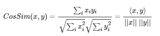

## MovieLens recommendation project ##

  

  

This project entails making movie recommendations via collaboration between user ratings and genre preferences. The dataset contains 100836 ratings and 3683 tag applications across 9742 movies. These data were created by 610 users between March 29, 1996 and September 24, 2018. The dataset consists of four csv files and a readme text file: links, movies, ratings, and tags with the following parameters:
* movies.csv
    * (9742, 3) rows/columns
    * 'movieId', 'title', 'genres'

* ratings.csv
    * (100836, 4) rows/columns
    * 'userId', 'movieId', 'rating', 'timestamp'

* tags.csv
    * (3683, 4) rows/columns
    * 'userId', 'movieId', 'tag', 'timestamp'

* links.csv
    * (9742, 3) rows/columns
    * 'movieId', 'imdbId', 'tmdbId'
    
* README.txt
    * much like a dictionary
    
>*The performance metric used to gauge success in this notebook is the root mean squared error. (RMSE)*
    
This data set has the propensity to recommend the most popular films(population bias), since they're the ones receiving the vast majority of ratings, some older films have litte to no ratings at all. The maximum rating is 5, lowest 1, and the average hoovers at 3.5. This may be useful in addressing cold start issues when attempting to recommend films to new users. Sort of recommending the "catch of the day". 
```python
ratings['rating'].describe()
count    100836.000000
mean          3.501557
std           1.042529
min           0.500000
25%           3.000000
50%           3.500000
75%           4.000000
max           5.000000
Name: rating, dtype: float64
```
  
    
**Similarity matrix's**

*Pearson similarity matrix*
```python
# corr(pearson) method adjusts for the mean by default so no further need to standardize. 
pearson_similarity = user_ratings.corr(method='pearson')
pearson_similarity.tail(5)
```
  

**User ratings based recommendations (pearson correlation matrix)**
 
```python
user = [('101 Dalmatians (1996)', 1), ('2001: A Space Odyssey (1968)', 4)]

similar_movies = pd.DataFrame()
    
for movie, rating in user:
    similar_movies = similar_movies.append(get_similar_movies(movie, rating), ignore_index = True)
    
similar_movies.sum().sort_values(ascending=False).head(10)

2001: A Space Odyssey (1968)                                                   1.333735
Blade Runner (1982)                                                            0.822194
Aliens (1986)                                                                  0.639186
Clockwork Orange, A (1971)                                                     0.614576
Dr. Strangelove or: How I Learned to Stop Worrying and Love the Bomb (1964)    0.603032
Apocalypse Now (1979)                                                          0.586503
Full Metal Jacket (1987)                                                       0.577457
Platoon (1986)                                                                 0.549155
Dark City (1998)                                                               0.541112
Alien (1979)                                                                   0.537291
```
*Cosine similarity matrix*
```python
# to compute a similarity score three options are available: euclidean, correlation (pearson), and cosine
tfV = TfidfVectorizer(analyzer='word', ngram_range=(1, 2), min_df=0, stop_words='english')
tfV_matrix = tfV.fit_transform(movies['genres'])

cosine_similarity = linear_kernel(tfV_matrix, tfV_matrix)
```
**Genre based recommendations**
 
```python
titles = movies['title']
indices = pd.Series(movies.index, index=movies['title'])

def genre_based_recommendations(title):
    idx = indices[title]
    similarity_scores = list(enumerate(cosine_similarity[idx]))
    similarity_scores = sorted(similarity_scores, key=lambda x: x[1], reverse=True)
    similarity_scores = similarity_scores[1:11]
    movie_indices = [i[0] for i in similarity_scores]

    return titles.iloc[movie_indices]

genre_based_recommendations('Zombieland (2009)')

7154                                    Zombieland (2009)
8434                                    Zombeavers (2014)
8565                    Dead Snow 2: Red vs. Dead (2014) 
9035         Scouts Guide to the Zombie Apocalypse (2015)
62                             From Dusk Till Dawn (1996)
6251                             Snakes on a Plane (2006)
6324                                         Feast (2005)
11                     Dracula: Dead and Loving It (1995)
654     Tales from the Crypt Presents: Bordello of Blo...
1478                                      Gremlins (1984)
```
**LightFM**
One great recommender model I found was LightFM, this recommender utilizes weighted approximately ranked pairwise (WARP) ranking loss. This makes the ranked items at the top more accurate than those on the bottom which is what you would want in a recommender system. Here the recommender is based three userIds and returns recommendations based on the known positives or what the user may have watched and ranked. LightFM is also considered a hybrid recommender meaning it can handle cold start problems and collaborative filtering. 
```python
from lightfm.datasets import fetch_movielens
from lightfm import LightFM

data = fetch_movielens(min_rating= 1)

model = LightFM(loss='warp')
model.fit(data['train'], epochs=30, num_threads= 4)

sample_recommendation(model, data, [6, 8, 11])

User 6
    known positives:
      Get Shorty (1995)
      Twelve Monkeys (1995)
      Babe (1995)
    Recommended:
         Raiders of the Lost Ark (1981)
         Jaws (1975)
         Psycho (1960)
         Sting, The (1973)
         Alien (1979)
         Silence of the Lambs, The (1991)
         Taxi Driver (1976)
         Aliens (1986)
         Good, The Bad and The Ugly, The (1966)
         M*A*S*H (1970)
User 8
    known positives:
      Twelve Monkeys (1995)
      Star Wars (1977)
      Evil Dead II (1987)
    Recommended:
         Star Wars (1977)
         Fargo (1996)
         Return of the Jedi (1983)
         Godfather, The (1972)
         English Patient, The (1996)
         Raiders of the Lost Ark (1981)
         Contact (1997)
         Liar Liar (1997)
         Toy Story (1995)
         Scream (1996)
User 11
    known positives:
      Get Shorty (1995)
      Mr. Holland's Opus (1995)
      Apollo 13 (1995)
    Recommended:
         Star Wars (1977)
         Raiders of the Lost Ark (1981)
         Return of the Jedi (1983)
         Back to the Future (1985)
         Fargo (1996)
         Silence of the Lambs, The (1991)
         E.T. the Extra-Terrestrial (1982)
         Schindler's List (1993)
         Pulp Fiction (1994)
         Forrest Gump (1994)
```
#### Future work:
Deeper study into neural network recommendation systems through pytorch via Nvidia cuda (gpu processing) and tinkering with the various loss functions and actual implementation via AWS or some other well known platform, this is waaaay cool! 